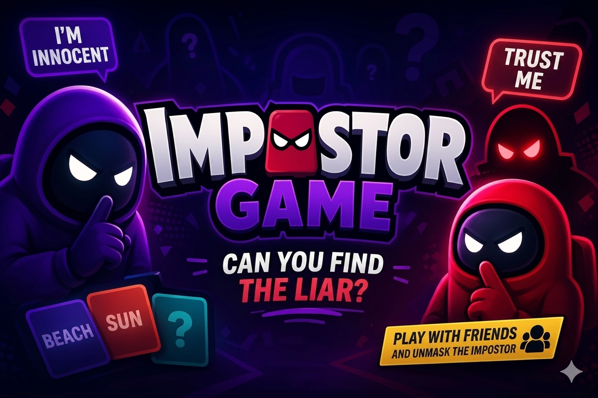

# 🕵️‍♂️ Impostor Game | Multiplayer Party Game
<br>

> Impostor Game is a multiplayer game where every player receives a secret word… except for one: the Impostor. <br>
> Through clues, deception, and deduction, players must uncover the impostor before they guess the actual word. <br>
> Fast-paced, social, and perfect for playing with friends. <br>

[](https://github.com/cesarhuesca-dev/impostor-game-front)
[](https://github.com/cesarhuesca-dev/impostor-game-back)
[](https://tailwindcss.com/)
[](https://opensource.org/licenses/MIT)

---

## 🎮 The Game

**Impostor Game** is a multiplayer experience inspired by viral social media deduction games, "Among Us," and "Taboo."

### How does it work?
1. Each player receives a **secret word** except for the **Impostor**.
2. **The Impostor:** One or more players who don't know the group's word and must try to guess it by following the rhythm of the round.
3. **Non-Impostors:** Players who receive the word and must provide clues/words related to the theme without revealing the actual word.
4. **The Challenge:** Using subtle clues, players must identify who the impostor is.
5. **The Goal:** The **Impostor** must go unnoticed and deduce the round's word, while the non-impostors must find and vote to eject them.

**Fast, social, and designed to be played with friends on any device.**

---

## 🎥 Additional Feature: Streamer Overlay

A dedicated **Overlay** for broadcasts. Use it as a template for your streams so your audience can follow the game's pace with a professional interface.

### How to use it:
1. Create a game and enable the "Overlay for Broadcasts" option in the settings.
2. In OBS (or your preferred streaming software), add a **Browser Source** pointing to the application URL.
3. Configure the parameters to fit your broadcast layout needs.
4. Use the "Interact" feature on the source to join as a spectator/player.

---

## 🏛️ Project Ecosystem

This project is divided into three independent repositories to maintain a clean and scalable architecture. <br>
Each repository can be downloaded and implemented separately: <br>

* 🌐 **[Frontend](https://github.com/cesarhuesca-dev/impostor-game-front):** Client-side SPA built with **Angular 21**.
* ⚙️ **[Backend](https://github.com/cesarhuesca-dev/impostor-game-back):** Robust API and real-time game logic powered by **NestJS 11**.
* 🏗️ **[Infrastructure](https://github.com/cesarhuesca-dev/impostor-game-infra):** Deployment configurations, Docker, and automation (Optional repository).

---

## 🛠️ Tech Stack

### Frontend
- **Framework:** Angular 21 (Signals, Control Flow, SSR)
- **UI & Styles:** PrimeNG 21 & Tailwind CSS 4
- **Communication:** Socket.io-client (Real-time)
- **Internationalization:** Ngx-translate

### Backend
- **Framework:** NestJS 11
- **Real-time:** Socket.io (WebSockets)
- **Database:** PostgreSQL with TypeORM (SQLite support for dev)
- **Security:** Passport JWT, Helmet, Throttler (Rate Limiting)
- **Validation:** Zod & Class-validator

---

## 🚀 Quick Start

### Prerequisites
- Node.js (v20+ recommended)
- Docker (optional for database management)

### Installation

1. **Clone the repositories:**
    ```bash
    git clone [https://github.com/cesarhuesca-dev/impostor-game-back.git](https://github.com/cesarhuesca-dev/impostor-game-back.git)
    git clone [https://github.com/cesarhuesca-dev/impostor-game-front.git](https://github.com/cesarhuesca-dev/impostor-game-front.git)
    ```

2. **Backend Setup:**

    2.1. **Configure Backend .env**
    ```bash
      ENVIRONMENT= #environment mode-> (development o production)
      FALLBACK_LANGUAGE=en

      DB_TYPE= # Database type -> (postgres or sqlite)
      DB_USER= # Database username
      DB_PASSWORD= # Database password
      DB_NAME= # Database name
      DB_PORT= # Database port (Default: 5432)
      DB_HOST= # Database host (localhost or your-domain.com)

      HOST_BACKEND= #Backend API URL without /api suffix -> (http://localhost)
      HOST_BACKEND_API= #Backend API URL with /api suffix -> (http://localhost/api)
      HOST_FRONT= #Frontend URL -> (http://localhost)

      SERVER_PORT= # Backend server port (Default: 3000)
      THROTTLE_TTL=60
      THROTTLE_LIMIT=10
      JWT_SECRET= # Secret string for JWT authentication

      WORD_API=https://random-words-api.kushcreates.com/api
    ```

    2.2. **Install packages and run**
    ```bash
      # In the backend directory, start the database (if using Postgres)
      docker compose up -d --build

      # Install dependencies
      npm install

      # For development mode:
      npm run start:dev

      # For production:
      npm run build
      npm run start:prod
    ```

3. **Frontend Setup:**

    3.1. **Configure environment files** (`assets/environments/environment.ts`)
      ```typescript
          export const environment = {
            production: true,
            URL_GMAIL: 'mailto:cesarhuesca.dev@gmail.com',
            URL_LINKEDIN: '[https://www.linkedin.com/in/cesarhuesca-dev/](https://www.linkedin.com/in/cesarhuesca-dev/)',
            URL_GITHUB: '[https://github.com/cesarhuesca-dev](https://github.com/cesarhuesca-dev)',
            URL_DISCORD: '[https://discord.com/users/rayoces_7029](https://discord.com/users/rayoces_7029)',
            URL_API: 'http://localhost:3000/api', // Backend API URL
            URL_WS: 'http://localhost:3000',      // Real-time connection URL
          };
      ```

    3.2. **Install packages and run**
    ```bash
      # Install dependencies
      npm install

      # For development:
      npm run start

      # For production build:
      npm run build
    ```

    Open your browser at the local URL and start playing!

---

## ✨ Key Features

- ⚡ **Real-Time:** Seamless gameplay experience powered by WebSockets.
- 🌍 **Multi-language:** Support for English, Spanish, German, French, Italian, and Portuguese.
- 🎨 **Modern Design:** Minimalist and responsive dark interface.
- 🧽 **Cleaning:** From time to time, the database is cleaned to avoid trash.
- 🎥 **Overlay:** Template for broadcasts, menu deactivatable with double click on the screen.
---

# 🙋 Contact

**[<span style="font-size: xx-large; align-self: center;">📩</span>](mailto:cesarhuesca.dev@gmail.com)**
**[](https://www.linkedin.com/in/cesarhuesca-dev/)**
**[](https://github.com/cesarhuesca-dev)**
