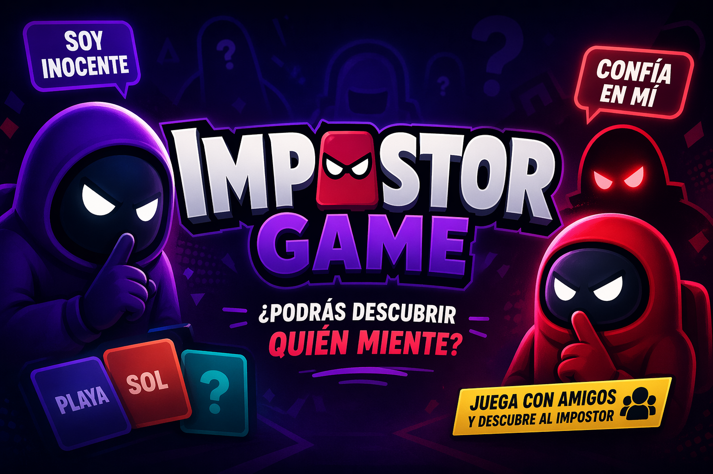

# 🕵️‍♂️ Impostor Game | Multiplayer Party Game
<br>

> Impostor Game es un juego multijugador en el que cada jugador recibe una palabra secreta… excepto uno, el impostor. <br>
> A través de pistas, engaños y deducción, los jugadores deben descubrir al impostor, antes de que el impostor adivine la palabra real. <br>
> Rápido, social y perfecto para jugar con amigos. <br>

[](https://github.com/cesarhuesca-dev/impostor-game-front)
[](https://github.com/cesarhuesca-dev/impostor-game-back)
[](https://tailwindcss.com/)
[](https://opensource.org/licenses/MIT)

---

## 🎮 El Juego

**Impostor Game** es una experiencia multijugador inspirada en el juego viral de redes sociales de adivinar al impostor, del juego Among Us y el juego tabú. 

### ¿Cómo funciona?
1. Cada jugador recibe una **palabra secreta** excepto el **Impostor**.
2. **El Impostor:** Un jugador o varios que no sabe la palabra del resto y tiene que intentar adivinarla siguiendo el ritmo de la ronda.
3. **NO Impostores:** Jugadores que reciben una palabra y tienen que decir palabras/pistas que esten relacionadas con la temática sin decir la palabra original.
4. **El Reto:** A través de pistas sutiles, los jugadores deben identificar quién es el impostor. 
5. **El Objetivo:** El **Impostor** debe pasar desapercibido y deducir la palabra de la ronda, mientras que los no impostores deben encontrarlo y votar para expulsarlo.

**Rápido, social y diseñado para jugar con amigos desde cualquier dispositivo.**

---

## 🎥 Caracteristica adicional

**Overlay** para retransmisiones, úsalo como plantilla para tus retransmisiones, para que tus espectadores vean el ritmo de la partida con una interfaz adecuada.

### ¿Cómo funciona?
1. Primero tienes que crear la partida y configurarla habilitando la opción overlay para retransmisiones.
2. Dentro OBS o en la aplicación para retransmisiones, tienes añadir la capa dentro de la escena en una fuente correspondiente añadiendo la url la aplicación.
3. Configuras los parametros correspondientes ajustando a tus necesidades de retransmisíon.
4. En la fuente le das a interactuar y te unes como un jugador normal creando un espectador.

---

## 🏛️ Ecosistema del Proyecto

Este proyecto está dividido en tres repositorios independientes para mantener una arquitectura limpia y escalable.<br>
Cada repositorio se puede descargar e implementar por separado:<br>

* 🌐 **[Frontend](https://github.com/cesarhuesca-dev/impostor-game-front):** Aplicación cliente SPA construida con **Angular 21**.
* ⚙️ **[Backend](https://github.com/cesarhuesca-dev/impostor-game-back):** API robusta y lógica de juego en tiempo real con **NestJS 11**.
* 🏗️ **[Infraestructura](https://github.com/cesarhuesca-dev/impostor-game-infra):** Configuraciones de despliegue, Docker y automatización, este repositorio es opcional.

---

## 🛠️ Stack Tecnológico

### Frontend
- **Framework:** Angular 21 (Signals, Control Flow, SSR)
- **UI & Estilos:** PrimeNG 21 & Tailwind CSS 4
- **Comunicación:** Socket.io-client (Tiempo real)
- **Internacionalización:** Ngx-translate

### Backend
- **Framework:** NestJS 11
- **Real-time:** Socket.io (WebSockets)
- **Base de Datos:** PostgreSQL con TypeORM (Soporte para SQLite en dev)
- **Seguridad:** Passport JWT, Helmet, Throttler (Rate Limiting)
- **Validación:** Zod & Class-validator

---

## 🚀 Inicio Rápido

### Requisitos previos
- Node.js (v20+ recomendado)
- Docker (opcional para base de datos)

### Instalación

1.  **Clonar los repositorios:**
    ```bash
    git clone [https://github.com/cesarhuesca-dev/impostor-game-back.git](https://github.com/cesarhuesca-dev/impostor-game-back.git)
    git clone [https://github.com/cesarhuesca-dev/impostor-game-front.git](https://github.com/cesarhuesca-dev/impostor-game-front.git)
    ```

2.  **Configurar y levantar el Backend:**

    2.1. **Configurar Backend .env**
    ```bash
      ENVIRONMENT= #Tipo de entorno-> (development o production)
      FALLBACK_LANGUAGE=es

      DB_TYPE= #Tipo de base de datos a utilizar -> (postgres o sqlite)
      DB_USER= #Nombre de usuario que usara la base de datos
      DB_PASSWORD= #Contraseña del usuario que usara la base de datos
      DB_NAME= #Nombre de la base de datos
      DB_PORT= #Numero de puerto que usara la base de datos, el de defecto -> (5432)
      DB_HOST= #Url de comunicacion para la base de datos, esto depende segun el entorno (localhost o https://tu-dominio/)

      HOST_BACKEND= #Url que se va a utilizar con el backend sin la extension /api -> (http://localhost)
      HOST_BACKEND_API= #Url que se va a utilizar con el backend CON la extension /api -> (http://localhost/api)
      HOST_FRONT= #Url que se va a utilizar para el front -> (http://localhost)

      SERVER_PORT= #Numero de puerto que usara el servidor backend, el de defecto -> (3000)
      THROTTLE_TTL=60
      THROTTLE_LIMIT=10
      JWT_SECRET= #Texto que se tiene que indicar para que el servidor backend haga el cifrado para la autenticacion

      WORD_API=https://random-words-api.kushcreates.com/api
    ```

    2.2. **Instalar paquetes y levantar entornos**
    ```bash
      #En la ruta de proyecto backend en entornos de locales primero levantar la base de datos
      #Siguiente comando solo valido si la base de datos es postgres
      docker compose up -d --build

      #Instalar paquetes y dependencias
      npm install

      #Segun necesidades, levantar en modo local siguiente comando:
      npm run start:dev

      #Segun necesidades, levantar en modo produccion siguiente comando y levantar con node el servidor
      npm run build
    ```

3.  **Configurar y levantar el Frontend:**

    3.1. **Configurar Frontend assets/environments/environment.ts o assets/environments/environment.development.ts**
      ```bash
          export const environment = {
            production: true,
            URL_GMAIL: 'mailto:cesarhuesca.dev@gmail.com',
            URL_LINKEDIN: 'https://www.linkedin.com/in/cesarhuesca-dev/',
            URL_GITHUB: 'https://github.com/cesarhuesca-dev',
            URL_DISCORD: 'https://discord.com/users/rayoces_7029',
            URL_API: 'http://localhost/api', #Url que se va a utilizar con la extension /api -> (http://localhost:3000/api)
            URL_WS: 'http://localhost',  #Url que se va a utilizar para la conexion de tiempo real, solo url -> (http://localhost)
          };
      ```

    3.2. **Instalar paquetes y levantar entornos**
    ```bash
      #Instalar paquetes y dependencias
      npm install

      #Segun necesidades, levantar en modo local siguiente comando:
      npm run start

      #Segun necesidades, levantar en modo produccion siguiente comando y levantar con node el servidor
      npm run build
    ```

    Accede a segun la url y ¡empieza a jugar!

---

## ✨ Características Principales

-   ⚡ **Tiempo Real:** Experiencia de juego fluida gracias a WebSockets.
-   🌍 **Multi-idioma:** Soporte a Inglés, Alemán, Francés, Italiano y Portugués.
-   🎨 **Diseño Moderno:** Interfaz
-   🧽 **Limpieza:** Cada cierto tiempo se hace limpieza de la base de datos para evitar basura.
-   🎥 **Overlay:** Plantilla para retransmisiones, menu desactivable con doble click en la pantalla.


# 🙋 Contacto

**[<span style="font-size: xx-large; align-self: center;">📩</span>](mailto:cesarhuesca.dev@gmail.com)**
**[](https://www.linkedin.com/in/cesarhuesca-dev/)**
**[](https://github.com/cesarhuesca-dev)**


---
